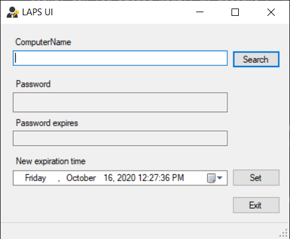

# Elevate to Administrator on a Local Lab Workstation or Desktop

## Document info

| Last update | Author         | Notes or changes                    |
|-------------|----------------|-------------------------------------|
| 2020/10/16  | Wagner         | Initial creation                    |

## Operating System(s) and requirements
* Windows 10

## Purpose
* Obtain temporary admin rights on your workstation to install software or change protected settings

## Procedure

Before following this procedure, make sure that the action you're planning to take that requires admin rights:
    * Is for lab-related business and required for your research
    * Does not compromise the security of your computer or the UW network (if you don't know why you're being asked for admin, don't grant it!)
    * Is aligned with terms of acceptable use issued by the deparment IT staff, the college, and the university
    * Would not be embarassing for you or your lab group if it showed up on the news

0. **Ensure you are approved to use admin rights.** Try this procedure, and if it fails, you may need to contact [Joshua Jankowski](mailto:joshua.jankowski@wisc.edu) to grant you the proper permissions. Copy your advisor on any emails.

1. If you are off-campus, **Set up VPN access**
    * Follow the links to [install and configure VPN](https://kb.wisc.edu/cae/5573), and to [activate VPN access](https://kb.wisc.edu/cae/page.php?id=23424)

    * _Undergrad researchers_ must request full VPN access that is not granted by default. Send an email based on the following template to the [CAE helpdesk](mailto:helpdesk@cae.wisc.edu) and **copy your advisor**
        > I am an undergraduate research working with **(name of advisor)** who is copied on this email and need to have VPN rights to allow for remote desktop connection to a lab computer that I will be using. Can you please modify my account (**myemail@wisc.edu**) to provide full or split VPN access?

    * Connect to VPN with your NetID and password

        

2. **Locate your computer name**. 
    * Right click on the Windows start menu icon
    * Click "System"
    * Locate the "Device Name". This is your computer name. 
    * Note that the computer's network name is <device name>.ad.engr.wisc.edu

    

3. In the Windows start menu, search for "LAPS UI" and launch the app.

    

    * Enter the computer name as it appears from step 2 and click "Search". A password and expiration date should appear. 

4. Execute the command requiring admin rights. This can be done by:
    * Right clicking an object, then select "Run as administrator" if available
    * Running the process that automatically prompts for admin rights

6. When prompted for your admin credentials, enter:
    * For username: "computer name\administrator"
    * For password, the password given by LAPS

            

7. Complete the task. Admin rights will automatically relinquish after the task completed or the application closed. 
