# Git (and Git Bash) Installation & Setup for Students

## Document info

| Last update | Author         | Notes or changes                    |
|-------------|----------------|-------------------------------------|
| 2020/10/13  | Springate      | Initial creation                    |

## Operating System(s) and requirements
* These instructions are based on Installation for a Windows 10, 64-bit operating system. 

## External references and procedures

* [Installing Python with miniconda]()
* [Installing VS Code]()
* [Windows admin rights]()

## Purpose
Install the Git-SCM command window client and Git toolsets on a local machine.

## Procedure

1. 1)	Visit [this link](https://git-scm.com/downloads) to download Git

2.	Choose the appropriate option for your system. 
    

3.	A file named “Git-2.28.0-64-bit” will start downloading.
    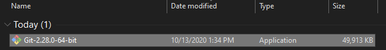

4.	Double click the installer to begin the installation process
    * Select the default location for Destination Location

        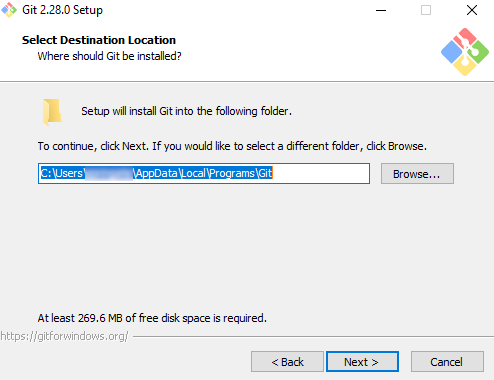

    * Select the default options for Components
        
        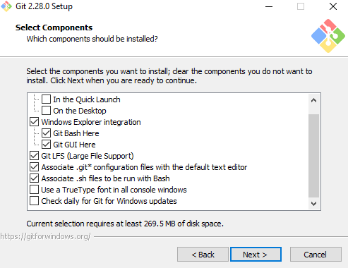

    * Select the default option for Start Menu Folder
        
        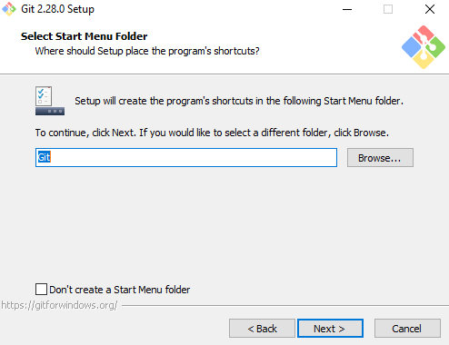

    * Select “Use Visual Studio Code as Git’s default editor”
        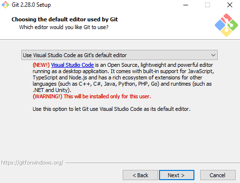

    * Select “Use Git from Git Bash only” for adjusting PATH environment
        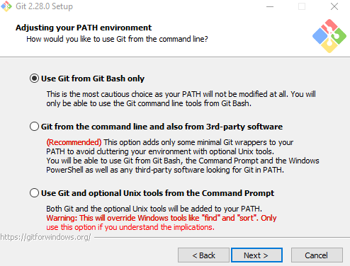

    * Select “Use the OpenSSL library” for HTTPS transport backend
        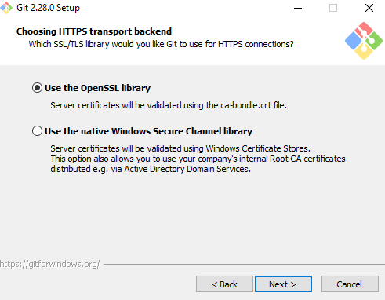
        
    * Select “Checkout Windows-style, commit Unix-style line endings”
        
        
    * Select “Use MinTTY” for terminal emulator to use with Git Bash
        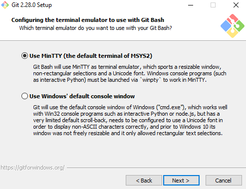
        
    * Select “Default (fast-forward or merge)” for ‘git pull’ behavior
        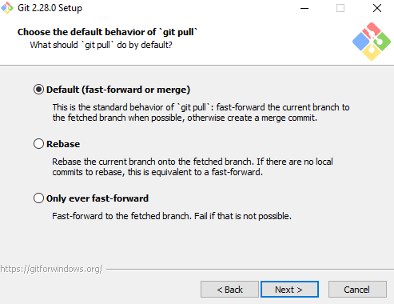
        
    * Select “Git Credential Manager” 
        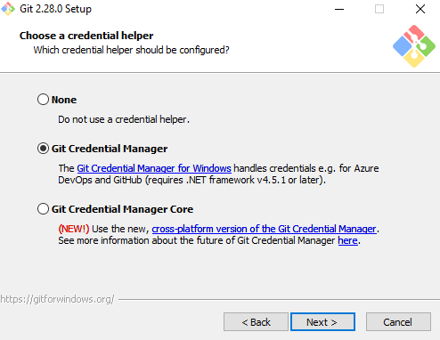

    * Select “Enable file system caching” for extra options
        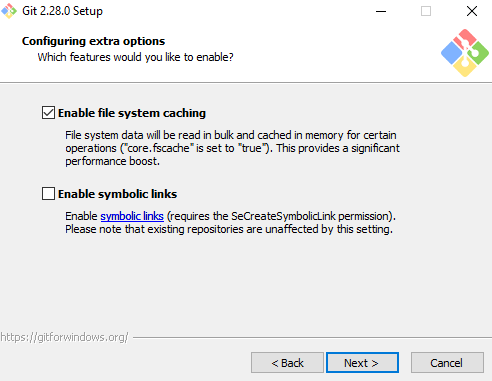

    * Install

5. A window like this will open
    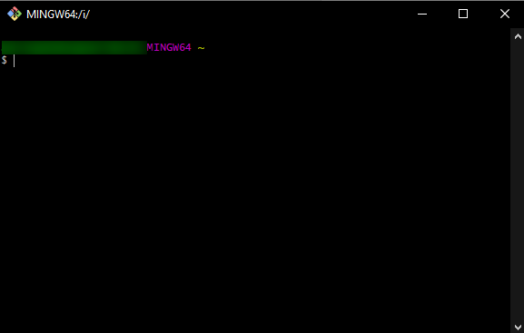

6. By default, Git Bash will launch in a folder like "Documents," but you may prefer to have it launch with the current working directory in the place where you store your repositories. To change the default working directory:
    * In the Windows launch area, search for "Bash"

        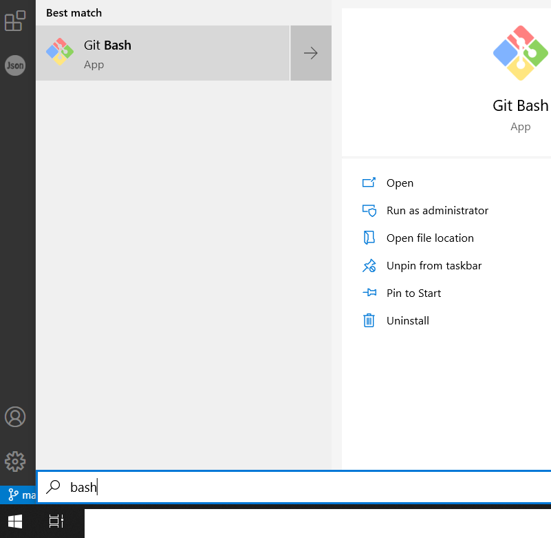

    * Right click and select "Open File Location"

    * In Windows Explorer, right click the "Git Bash" shortcut and select "Properties"
        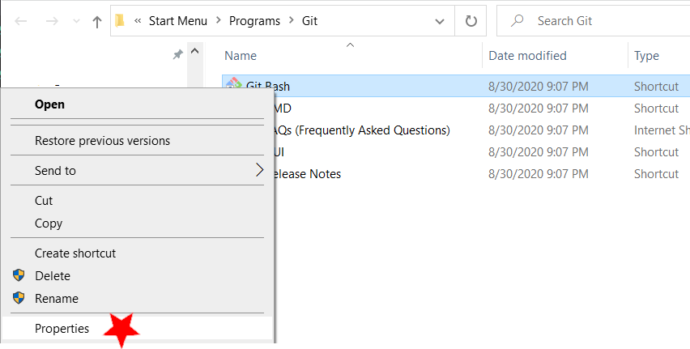

    * On the Shortcut tab, the default settings for "Target" and "Start in" should be changed. To start, you might see:
        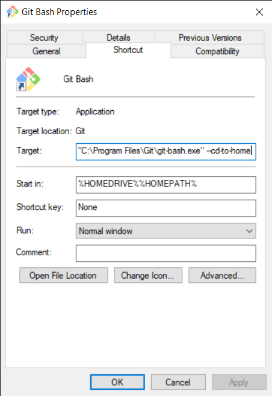

    * Remove `--cd-to-home` from Target, and set the Start In path to the folder where you keep your repositories.
        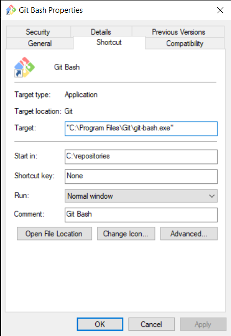 

    * Click Ok, and re-launch Bash. 