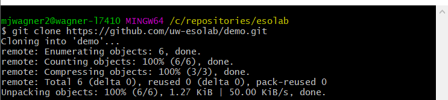
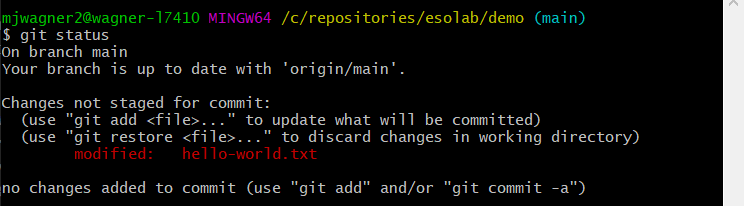
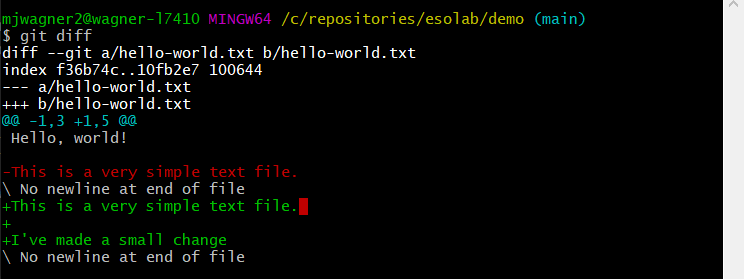
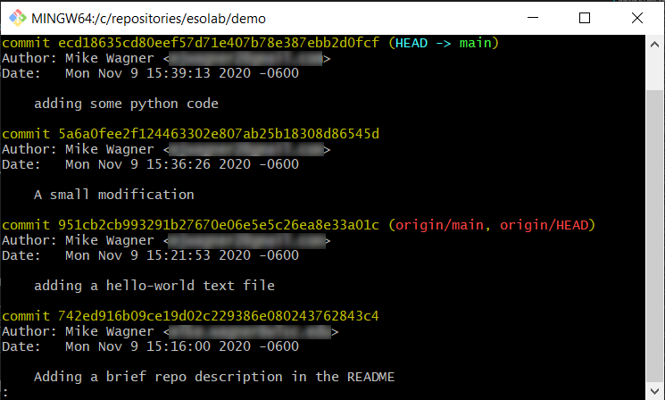
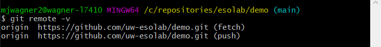
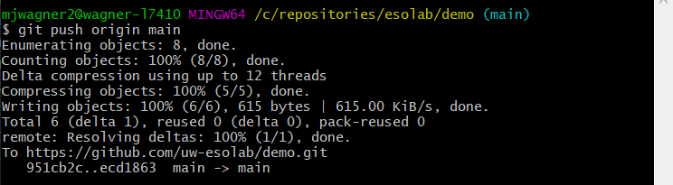
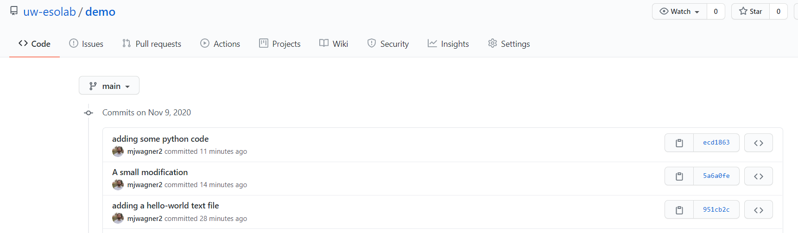

# Git (and Git Bash) Installation & Usage for Students

## Document info

| Last update | Author         | Notes or changes                    |
|-------------|----------------|-------------------------------------|
| 2020/11/09  | Wagner         | Adding guidance for Git usage       |
| 2020/10/14  | Wagner         | Moving to markdown format           |
| 2020/10/13  | Springate      | Initial creation                    |


## Operating System(s) and requirements
* These instructions are based on Installation for a Windows 10, 64-bit operating system. 
* This procedure assumes prior installation of [VS Code](https://github.com/mjwagner2/esolab/blob/main/vscode/vscode.md)

## Purpose
1. Learn how to use Git
2. Install the Git-SCM command window client and Git toolsets on a local machine.

***

## Procedure for Use of Git Tools

If you do not yet have the Git-SCM Bash tool installed, skip down to [Procedure for Git Bash Installation](#procedure-for-git-bash-installation) in this document and complete that first.

You may find the following resources useful in learning Git: 
* [Overview of version control systems](https://www.atlassian.com/git/tutorials/what-is-version-control)
* [Git tutorial from Git Bash creators](https://git-scm.com/docs/gittutorial)
* [Interactive tool to try Git commands](http://git-school.github.io/visualizing-git/)
* [Common approach for creating branches](https://nvie.com/posts/a-successful-git-branching-model/)

### What is version control?
Version control systems (VCS) allow users to manage and record changes to projects (most typically, computer code) and to work collaboratively with others who might be contributing to the same project. The most common VCS's used today are either _Git_ or _Subversion_; the ESOLab uses Git for all projects and holds an [account on GitHub](https://github.com/uw-esolab). 

Git is an architecture that tracks and integrates project contributions using a single, centrally-hosted repository and local copies of the repository on local users' machines. In general, the workflow for Git is as follows:

1. A central repository is created on a host service such as [GitHub](https://github.com/), [BitBucket](https://bitbucket.org/product), or a institutional server
2. Users "clone" the files from the central repository to their local computer
3. A user can make a change, add, or delete material working on the local copy
4. At some convenient point, the user records changes they've made by issuing a "commit" of their code. _This change is only recorded on the user's local computer. Other users can not access or view the user's changes at this point._
5. After one or more commits have been recorded, the user may "push" the committed changes from their local machine back to the central repository, publishing their contributions and making them available to other users.
6. Changes recorded on the central repository may be incorporated into a user's local copy of the repository by "pull" command.
7. Git includes tools and systems to automatically or manually resolve any conflicting contributions from multiple users.

The following table defines several important terms or concepts that are often a source of confusion for those learning to use Git:

| Term                | Definition                                              |
|---------------------|---------------------------------------------------------|
| (Git) Bash | A command-line tool that accepts, interprets, and carries out Git commands. Bash serves as the interface between the user and the Git repository. |
| Branch | A thread of commits related to a single topic; a branch diverges from a specific point in the main thread of effort and is isolated from other activity. It can later be _merged_ back into the main effort. |
| Commit | The act of recording one or more changes made to local versions of tracked project files | 
| Fork | The act of copying another existing repository to your own hosted account for the purpose of extending the prior work under a new or distinct project (as opposed to "clone," which intends contributions to the existing project).| 
| Git | A commonly used version control system |
| GitHub | A web service that hosts software projects that use Git |
| Local machine | A computer on which a user does day-to-day work (e.g., your laptop); as opposed to a server, for example |
| Push | The act of transmitting changes recorded by commit from your local machine to the server hosting the central repository |
| Remote | The name and location of a central repository |
| Repository | A collection of code, text files, or other trackable content that is monitored by the version control system |
| Server | A (typically) remote machine that hosts a shared repository and is accessible to all project contributors |
| Version control system | A software program that records and can retrieve historical versions of files in a repository. |
||


**A note on graphical user interface (GUI) options**

Several graphical (non-command-line) options are available for use as a Git interface, including options provided by IDE's like VS Code, by GitHub, or even Git-SCM. These interfaces can have a simpler feel for new users, but they also tend to mask important details about the exact commands being executed when an action is taken. My experience has been that it is much easier to get into serious repository trouble when using a GUI option. GUI's often have limited functionality in comparison to command line tools, so you may find that you will need to learn the command tools anyways to resolve issues that can't be corrected in the GUI. For these reasons, I strongly recommend starting with the command line tools.


### Why do we use version control for grad research?

The need for VCS for research may not be apparent - you are accustomed to working with other students on projects with a variety of sharing tools like Dropbox, Teams, Slack, or even email; you have written code for homework or for undergrad research, and this all seems a bit... unnecessary.
A VCS is not right for every student and situation, but it can be very useful for:
* Contributing to projects that have a nontrivial code development component
* Writing and tracking progress for individual code projects
* Providing a central repository for important files that your advisor(s) or other students can access
* Tracking and documenting progress for research customers (e.g., funding agencies)
* Providing snapshots of your research that can be revisited at a later date
* Backing up your work or thesis writing
* Sharing your open-source work with the broader research community

Keep in mind that your graduate research is likely much broader and of longer duration than anything you've done before. Organization and record-keeping are of critical importance, and you will likely have several "false starts" that require you to either backtrack to a previous point in your work, or you may be asked to recreate model results for comparative purposes. VCS's build in this type of functionality and may save you months of time later on. Finally, your work is part of a continuity in research and should be preserved for the students coming after you. 

### Quick reference

| Command | Description | Example usage | 
|---------|-------------|---------------|
| `--help` | View help docs for a particular command | `> git <command> --help` |
| `clone` | Copy files from a central repository to your local machine | `> git clone https://github.com/uw-esolab/<my repo name>.git` | 
| `pull` | Collect changes that have been published to the central repository and replicate them on your local copy of the repo | `> git pull` |
| `checkout` (branch) | Switch your local repo to reflect the most recent version of another branch in the repo. | `> git checkout my-branch`<br>or<br>`> git checkout -b my-new-branch` <br>to create and switch to a new branch|
| `checkout` (file) | Discard local changes and restore a file to the version last collected from the server | `> git checkout ./path/to/my-modified.py`|
| `remote` | Report a list of known remote servers and their local alias | `> git remote -v`|
| `add` | Select file(s) or specific changes for inclusing in an upcoming commit | `> git add ./path/to/myfile.py` <br>or <br>`> git add /.` |
| `fetch` | Collect changes from the remote server named "origin" with branch "main," but do not update the local repo | `> git fetch origin main` | 
| `pull` | Collect changes from the remote server named "origin" with branch "main," and update the local repo | `> git pull origin main` | 
| `commit` | Record changes to files ("add"ed files only) | `> git commit -m "note describing this commit"` |
| `push` | Publish one or more commits to a remote server named "origin" on branch "main" | `> git push origin main` |
| `status` | Report the current state of the local repo, including files changed, current branch, commits ahead/behind, etc. | `> git status` |
| `log` | Report recent commits made | `> git log`|
| `branch` | List known branches, create or delete a branch | `> git branch`<br>or<br>`> git branch my-new-branch`<br>or<br>`> git branch -d my-deleted-branch` |
||


### Typical workflow

While Git provides **a lot** of functionality, you will find you most often use a very limited and simple subset of the commands. This section walks you through typical workflow. This assumes a repo has already been created on GitHub. 

Begin by opening Git Bash. Each command needs to be typed in to the command window as it appears. We will consider an example repository called "demo". This repo actually exists, so you can test using it or swap out the name with your actual repository.
* In Bash, change directories to the location that you want to store your repository
    ```
    > cd C:/users/astudent/repositories
    ```
* Clone a remote repository
    ```
    > git clone https://github.com/uw-esolab/demo.git
    ```
    You should see a new folder in `repositories` with the same name as the GitHub repository that you cloned.
    
* Change directories into the new repo
    ```
    > cd demo
    ```
* Open a file contained in the repository and make changes. For this example, I add the text "I've made a very small change." to the `hello-world.txt` file. Save the file.
* Display info about modified file(s)
    ```
    > git status
    ```
    

* Show details about changes that you made
    ```
    > git diff
    ```
    
    
    Note that deletions are shown in red and additions in green.

* Stage the change for the next commit and create the commit.
    ```
    > git add ./hello-world.txt
    > git commit -m "A small modification"
    ```
    Or, by shorthand:
    ```
    > git commit -a -m "A small modification"
    ```

* Create and add a new file to the repo. I created a Python file called `sample-code.py` and added `print("Hello world!")` on the first line. 

    Check the status with `> git status` (this is a recurring theme - you will use `status` very frequently and after many commands to view the effect of your commands):
    
    
    Add the file for the next commit. New files need to be added with the `add` command explicitly (can't use the `-a` flag.) Commit the new file.
    ```
    > git add ./sample-code.py
    > git commit -m "adding some python code"
    ```

* View the log of commits
    ```
    > git log
    ```
    

    Note that your commits have not yet been published to the central server, and only your local machine has any record of these commits! If you are ready to publish your changes, move to the next step.

* Check the name of remote repositories associated with your local repo.
    ```
    > git remote -v
    ```
    This displays the remote repository _alias_, which by default is "origin," and the URL of the remote repository. The name may differ depending on action (push vs fetch) but is identical by default.

    

* Check for and incorporate any changes that other contributors have made.
    ```
    > git pull
    ```

    If any conflicts are discovered, use:
    ```
    > git mergetool
    ```
    resolve conflicts, and commit the resulting merged files.

* **Note that actually completing this step will publish your changes to the uw-esolab/demo repository!** Push your changes to the remote server with alias "origin." You must also specify the branch you wish to publish to. This should almost always match the local branch name on which you've made changes ("main" in this case). 
    ```
    > git push origin main
    ```

    

* Visit the [GitHub repo](https://github.com/uw-esolab/demo/commits/main). Your commits should now be visible!
    


******

## Procedure for Git Bash Installation

1. Visit [this link](https://git-scm.com/downloads) to download Git

2.	Choose the appropriate option for your system. 
    


3.	A file named “Git-2.28.0-64-bit” will start downloading.

    


4.	Double click the installer to begin the installation process
    * Select the default location for Destination Location

        

    * Select the default options for Components
        
        

    * Select the default option for Start Menu Folder
        
        

    * Select “Use Visual Studio Code as Git’s default editor”
    
        

    * Select “Use Git from Git Bash only” for adjusting PATH environment
    
        

    * Select “Use the OpenSSL library” for HTTPS transport backend
    
        
        
    * Select “Checkout Windows-style, commit Unix-style line endings”
    
        
        
    * Select “Use MinTTY” for terminal emulator to use with Git Bash
    
        
        
    * Select “Default (fast-forward or merge)” for ‘git pull’ behavior
    
        
        
    * Select “Git Credential Manager” 
    
        

    * Select “Enable file system caching” for extra options
    
        

    * Install

5. A window like this will open

    

6. By default, Git Bash will launch in a folder like "Documents," but you may prefer to have it launch with the current working directory in the place where you store your repositories. To change the default working directory:
    * In the Windows launch area, search for "Bash"

        

    * Right click and select "Open File Location"

    * In Windows Explorer, right click the "Git Bash" shortcut and select "Properties"
        

    * On the Shortcut tab, the default settings for "Target" and "Start in" should be changed. To start, you might see:
        

    * Remove `--cd-to-home` from Target, and set the Start In path to the folder where you keep your repositories.
         

    * Click Ok, and re-launch Bash. 
