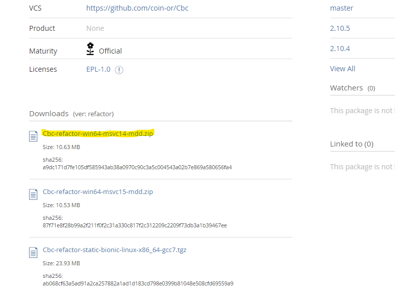
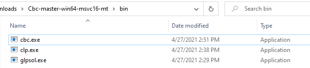

# Configuring Python for Pyomo 

## Document info

| Last update | Author         | Notes or changes                    |
|-------------|----------------|-------------------------------------|
| 2020/10/13  | Wagner         | Initial creation                    |


## Operating System(s) and requirements
* Windows 10
* Python 3.8+ (miniconda)

## External references and procedures

* [Installing Python with miniconda]()
* [Installing VS Code]()
* [Windows admin rights]()

## Purpose
Configure Python 3+ installed on a local machine to be used with Pyomo, which is a optimization modeling language developed for compatibility with multiple open-source and commercial solvers, including CPLEX, Gurobi, GLPK, CBC, and others. 

## Procedure

### Windows 10
1. **Download binaries for the appropriate solver.** These are used by Pyomo when solving the optimization problem
    1. CBC (COIN-OR): 

        The direct link for the most recent download as of this date is [here](). The link to the Bintray webpage is [here](https://bintray.com/coin-or/download/Cbc). Locate the most recent distributable that is compatible with your system. For example:

        

    1. GLPK ()

2. **Extract download files to a temporary folder.** You may not need to use all of the subfolders or extracted files.

3. **Locate the executable (.exe) and dynamic link library (.dll) files**, likely in a "bin" folder. These are the binary files that execute the solver. The CBC solver files are located in the /bin/ folder as shown below:
    

4. **Copy the binaries to the Python Scripts folder.** Navigate to your Python installation folder. This may be:
    `C:\ProgramData\Miniconda3\Scripts\`  
    `C:\Python38\Scripts\`

    You can locate the python installation folder by opening a command window and executing:  
    `> where python`

5. **Install Pyomo.** Pyomo is best installed via `pip` or `conda` in the command window. 
    1. Open a command window (with admin rights, if you installed Python using admin rights). 

    2. Install Pyomo. You can refer to the [Pyomo documentation](https://pyomo.readthedocs.io/en/stable/installation.html) for the most recent instructions.    
        `>conda install -c conda-forge pyomo`

        Hit `[y]` when prompted to continue.


6. **Test your installation.**
    Create a new python file where we'll test whether the solver is working appropriately. Paste the following minimal working example into the solver:

    ```
    import pyomo.environ as pyomo
    import random 
    import matplotlib.pyplot as plt

    # Create a model
    model = pyomo.ConcreteModel()

    # Time series
    model.nt = pyomo.Param(initialize = 20)
    model.T = pyomo.Set(initialize = range(model.nt()))

    # Create some random input data
    xtmp = {}
    for t in range(model.nt()):
        xtmp[t] = random.uniform(0,100)

    # Assign parameter values
    model.X_in = pyomo.Param(model.T, initialize=xtmp)
    model.XM = pyomo.Param(initialize=max(xtmp.values()))
    model.X0 = pyomo.Param(initialize=50)

    # setup an array of continuous and binary variables over the time domain
    model.x = pyomo.Var(model.T, domain=pyomo.NonNegativeReals)
    model.y = pyomo.Var(model.T, domain=pyomo.Binary)

    # Maximize x 
    def f_objective(model):
        return sum([model.x[t] for t in model.T])
    model.objective = pyomo.Objective(rule = f_objective, sense = pyomo.maximize)

    # ---Add some constraints

    # x[t] less than X_in for all t
    def f_x_lim(model, t):
        return model.x[t] <= model.X_in[t]
    model.c_x_lim = pyomo.Constraint(model.T, rule = f_x_lim)

    # x[t] is limited by value of binary y[t]
    def f_x_y(model, t):
        return model.x[t] <= model.XM()*model.y[t]
    model.c_x_y = pyomo.Constraint(model.T, rule = f_x_y)

    # y[t] can only be 1 when X_in[t] > X0
    def f_y_x0(model, t):
        return model.y[t] <= model.X_in[t] / model.X0
    model.c_y_x0 = pyomo.Constraint(model.T, rule = f_y_x0)

    # ------ solve and print out results
    #solver setup
    #solver = pyomo.SolverFactory('glpk')
    solver = pyomo.SolverFactory('cbc')
    res = solver.solve(model)

    print(res)
    print(model.objective())

    # Space-separated list of variables to print
    pouts = "X_in x y".split()

    # Automatically handle printing
    print('t\t'+'\t'.join(pouts))

    for t in model.T:
        fmt = "{:d}" + "\t{:.1f}"*(len(pouts))
        outs = []
        for o in pouts:
            try:
                outs.append(model.__getattribute__(o)[t]() )
            except:
                outs.append(model.__getattribute__(o)[t] )
        print( fmt.format(*([t]+outs)) )

    plt.plot([mt for mt in model.T], [mx() for mx in model.x.values()], \
            [mt for mt in model.T], [mx for mx in model.X_in.values()], \)
            [0, model.nt()], [model.X0(), model.X0()], 'r--')
    plt.show()
    ```

    You should get something that qualitively looks like the following, with values falling below the minimum threshold (50, in this case) forced to zero by the binary variable:   

    


## Known Issues or Common Problems