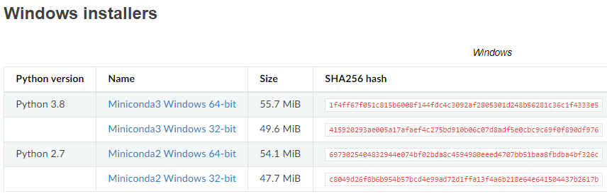
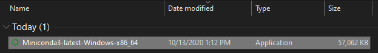
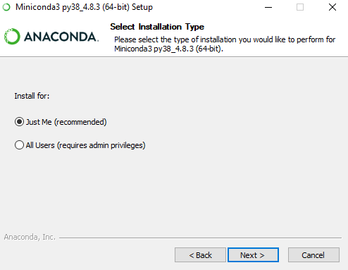
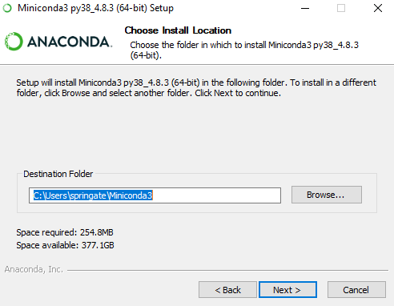
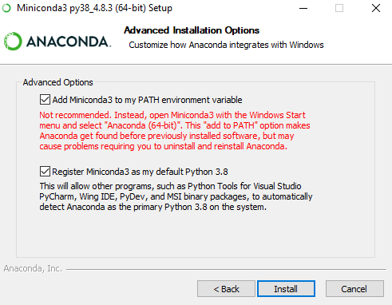
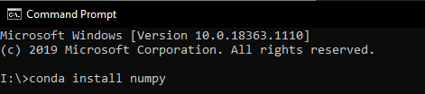
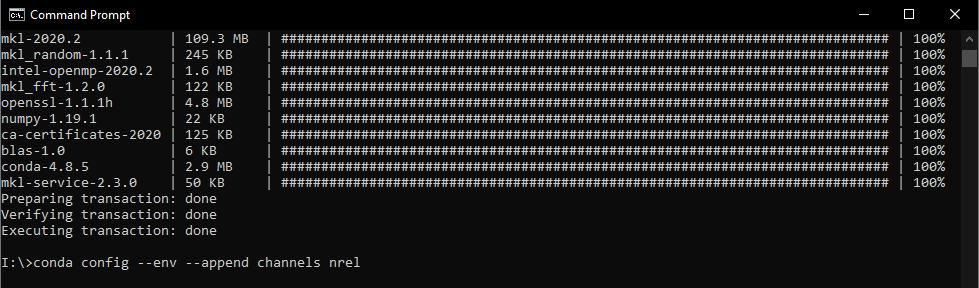
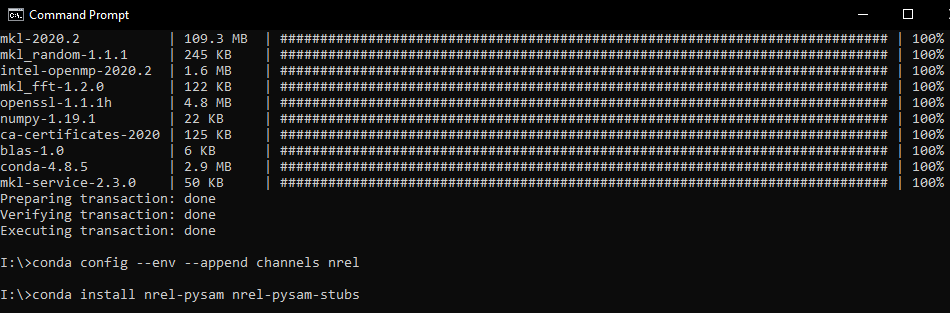
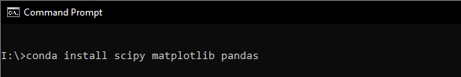

# Python Installation & Setup for Students

## Document info

| Last update | Author         | Notes or changes                    |
|-------------|----------------|-------------------------------------|
| 2020/10/14  | Wagner         | Moving to markdown format           |
| 2020/10/13  | Springate      | Initial creation                    |

## Operating System(s) and requirements
* These instructions are based on Installation for a Windows 10, 64-bit operating system. 

## Purpose
Installs Python 3+ on a local machine.

## Procedure

1.	Visit [this page](https://docs.conda.io/en/latest/miniconda.html) to download Miniconda, a free minimal installer for Conda Python.

2. Choose the appropriate option for your system.

    

3. A file named “Miniconda3-latest-Windows-x86_64” will start downloading. 

    

4.	Double click the installer to begin the installation process. 
    * Select “I Agree”
    * Select “Just Me” for Installation Type 

        
    
    * Select default location for Install Location

        

    * Select all boxes for Advanced Installation Options

        

    * Install
    * Finish

5. Install Common Python Packages

    * Open Command Prompt
    * Follow the commands in the window below. Type “y” to proceed when prompted. 

        

    * Follow the commands in the window below

        

    * Follow the commands in the window below. Type “y” to proceed when prompted

        

    * Follow the commands in the window below. Type “y” to proceed when prompted.
        
    
