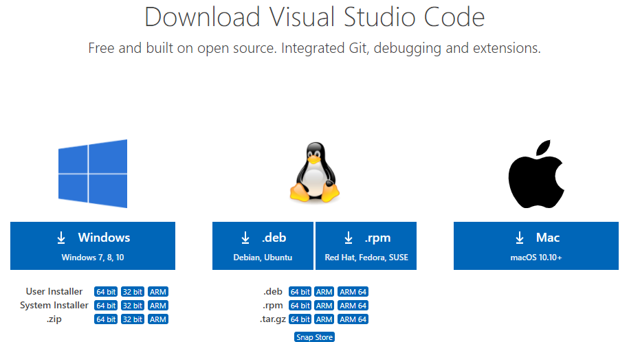
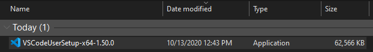
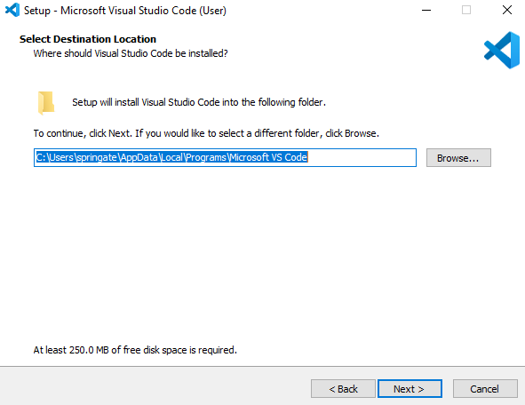
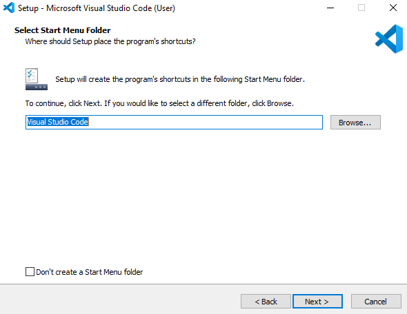
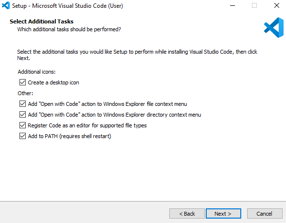
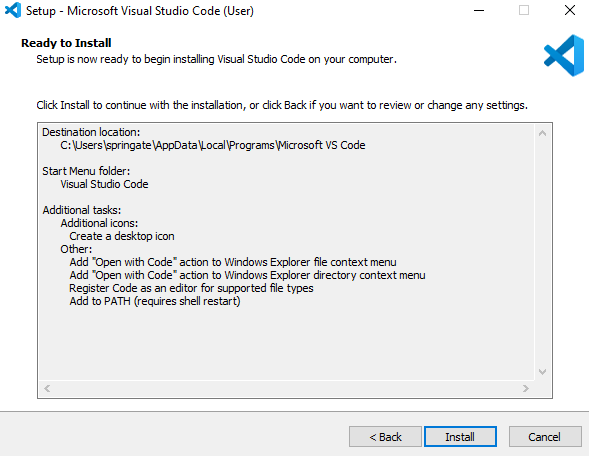
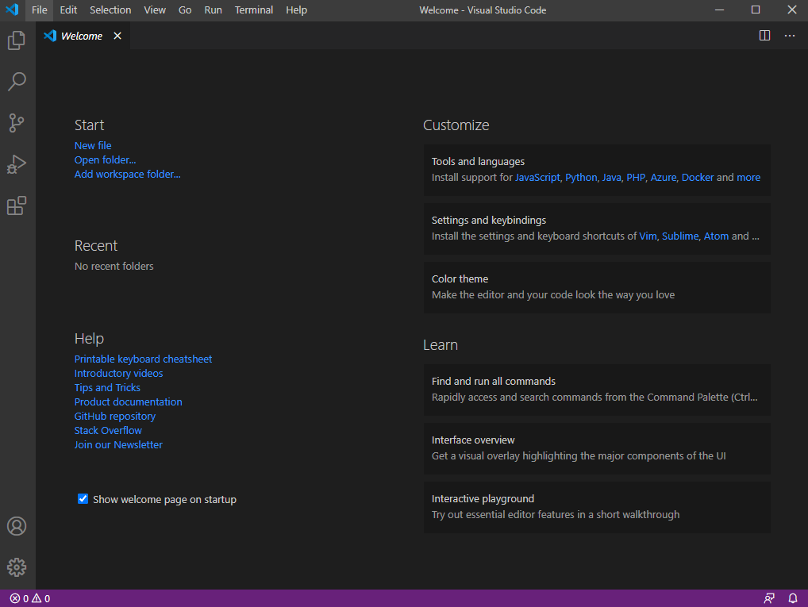
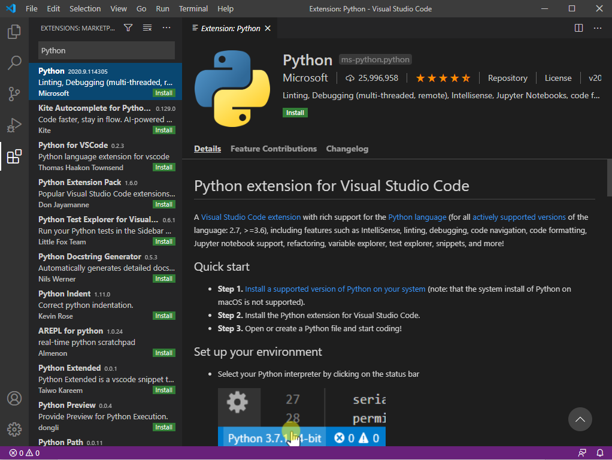

# VS Code Installation & Setup for Students

## Document info

| Last update | Author         | Notes or changes                    |
|-------------|----------------|-------------------------------------|
| 2020/10/14  | Wagner         | Moving to markdown format           |
| 2020/10/13  | Springate      | Initial creation                    |

## Operating System(s) and requirements
* These instructions are based on Installation for a Windows 10, 64-bit operating system. 
* This procedure assumes prior installation of [Python](https://github.com/mjwagner2/esolab/tree/main/python/python.md)

## Purpose
Install the VS Code integrated development environment on a local machine.

## Procedure

1. Visit [this link](https://code.visualstudio.com/download) to download VS Code

2. Choose the appropriate option for your system. 

    

3.	A file named “VSCodeUserSetup-x64-1.50.0” will start downloading.     

    

4.	Double click the installer to begin the installation process. 
    * Select “I accept the agreement” 
    * Select default location for destination folder

    

    * Select default location for start menu folder

    

    * Check all boxes for additional tasks

    

    * Install

    

    * Welcome to VS Code

    

    * Select Extensions and search “Python” – Install 
    
    

